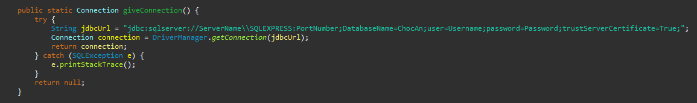
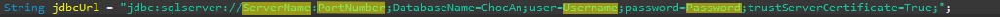

# Chocoholics Anonymous
Software created for the fictitious Chocoholics Anonymous company for a Computer Science course project.
# WARNING
This software utilizes Microsoft's SQL Server 2022 Express. If you do not have SQL installed, please follow the tutorial included in the SQLInstall.md file before running the project.
# Project Initialization For Eclipse
1. Install the ChocoholicsAnonymous zip.
2. Unzip the zip in your desired location.
3. Select "File" -> "Import" in Eclipse.
4. Select "General" -> "Existing Projects into Workspace."
5. Choose the root directory of the unzipped project (the ChocoholicsAnonymous folder).

# Project Initialization For IntelliJ IDEA
1. Install the ChocoholicsAnonymous zip.
2. Unzip the zip in your desired location.
3. Select "File" -> "Project from Existing Sources" in IntelliJ IDEA.
4. Select the ChocoholicsAnonymous folder from the unzipped zip.
5. Under "Create project from existing sources" select Eclipse.
6. Identify the project name or click next.
7. Ensure the src folder is the folder shown and click next.
8. Ensure jdbc driver appears and click next.
9. Click next.
10. Under "Classpath" click the "+" and locate the "lib" folder within the project folder.
11. Inside the lib folder select "mssql-jdbc-12.4.2jre11.jar and press OK.
12. Click next.
13. Click create.
14. Click "File" -> "Project Structure".
15. On the left menu select "Modules".
16. Click the "resources" folder and click "Sources" to select this folder as a source folder.
17. Click "Apply" then OK.
# SQL Setup
1. Access the "CreateSQL" class and find the method titled "giveConnection"

2. In this method you will see "String jdbcURL"; this is what you need to change.

3. Replace "ServerName" with your server name, which can be found at the top of the Object Explorer in SSMS (remember to use two forward slashes if your server name includes a forward slash).

4. Replace "PortNumber" with your port number Note: If you do not know what port your server is on follow these steps

        Open the Sql Server Configuration Manager.

        Select "Protocols for SQLEXPRESS" within the SQL Server Network Configuration dropdown.

        Right-click "TCP/IP" and select "properties".

        Select the "IP Addresses" tab.

        Scroll to the bottom and you should see "TCP Dynamic Ports" with your port listed.

5. Replace "Username" and "Password" with your SQL Server username and password.
6. Open SSMS and log in with the user you are going to use for this software.
7. Execute this query

        CREATE DATABASE ChocAn;
   
8. For your first time running the software, open the GUI class and run the program!

